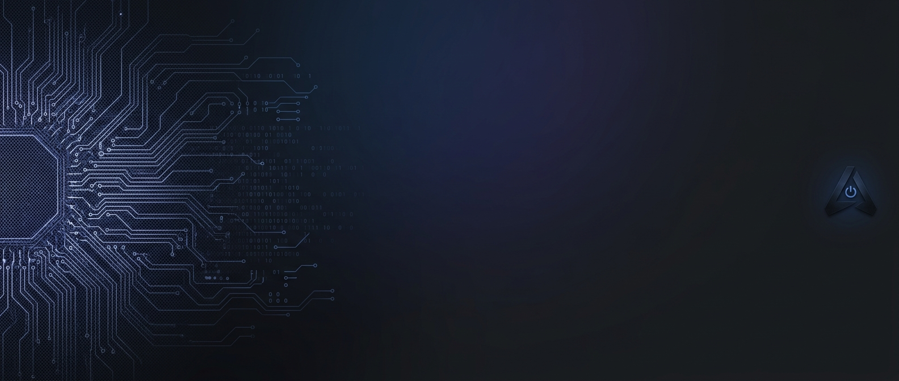

  <!-- Night Owl Banner Image -->
  

    

  <h1>🦉 Night Owl</h1>

  
<b>Crafting opinionated software, web tools, and experiments in the late hours.</b>

  <!-- Badges -->
  
  
  

   
  

 

### 🌙 About the Studio

Night Owl is an independent, low-key software hub created to house side projects, dynamic web tools, and utility-first apps. Built around quick iteration, clean engineering, and intuitive user experiences.

* ⚙️ **Stack Preferences:** TypeScript, React/Next.js, Tailwind CSS, Python, Swift
* 🛠️ **Philosophy:** Simple solutions for practical problems, executed with high visual polish
* ⚡ **Output:** Production-ready side quests built outside daylight hours

---

### 📦 Active Projects & Experiments

> *A showcase of apps built under the Night Owl umbrella.*

| Project | Description | Tech Stack | Status |
| :--- | :--- | :--- | :---: |
| 🚀 **[Project Name 1](https://github.com/nightowldevstudio/project-1)** | A brief, punchy one-liner explaining what this app does. | `TypeScript` `Next.js` | 🟢 Live |
| 🛠️ **[Project Name 2](https://github.com/nightowldevstudio/project-2)** | A brief, punchy one-liner explaining what this app does. | `React Native` `Expo` | 🟡 Beta |
| ⚡ **[Project Name 3](https://github.com/nightowldevstudio/project-3)** | A brief, punchy one-liner explaining what this app does. | `Python` `FastAPI` | 🛠️ In Dev |

---

 

  Built with care under the night sky.  
   
  © Night Owl. All rights reserved.

